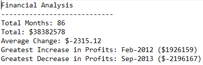
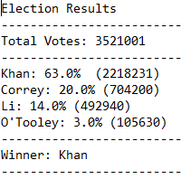

# Budget and Election Data Analysis
The respository analyses a budget dataset and an election dataset using python and outputs the results as text files.

### PyBank
The PyBank folder contains a python script for analysing the financial records of a hypothetical company. It analyses the [budget_data](PyBank/Resources/budget_data.csv) dataset to find the
- total number of months included in the dataset
- net total amount of "Profit/Losses" over the entire period
- average of the changes in "Profit/Losses" over the entire period
- greatest increase in profits (date and amount) over the entire period
- greatest decrease in losses (date and amount) over the entire period

and outputs it as a text file

### PyPoll
The PyPoll folder contains a python script for analysing the results of a small, rural town's [election](PyPoll/Resources/election_data.csv) including
- the total number of votes cast
- a complete list of candidates who received votes
- the percentage of votes each candidate won
- the total number of votes each candidate won
- the winner of the election based on popular vote.

and outputs it as a text file

 

## Tools/Packages used
- Python

 

## How to use
- Download the repository.
- Open either the **PyBank** or **PyPoll** folders.
- Open Git Bash and type `python main.py` to generate the results.
- Open the **analysis** folder to find the outputed text file containing the results.
